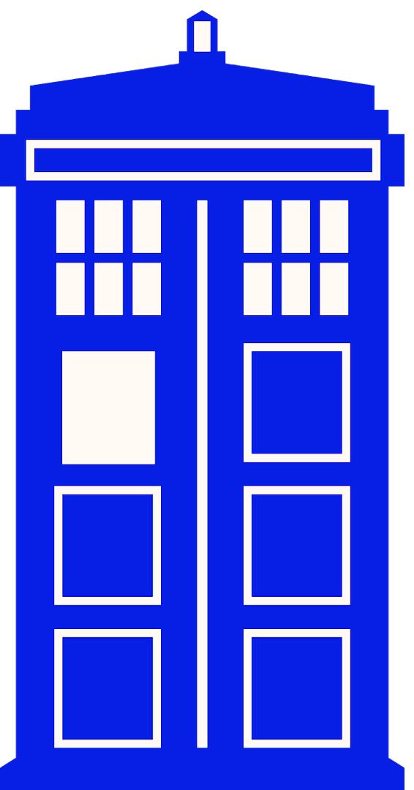
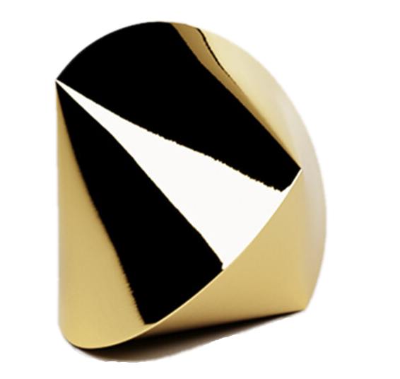
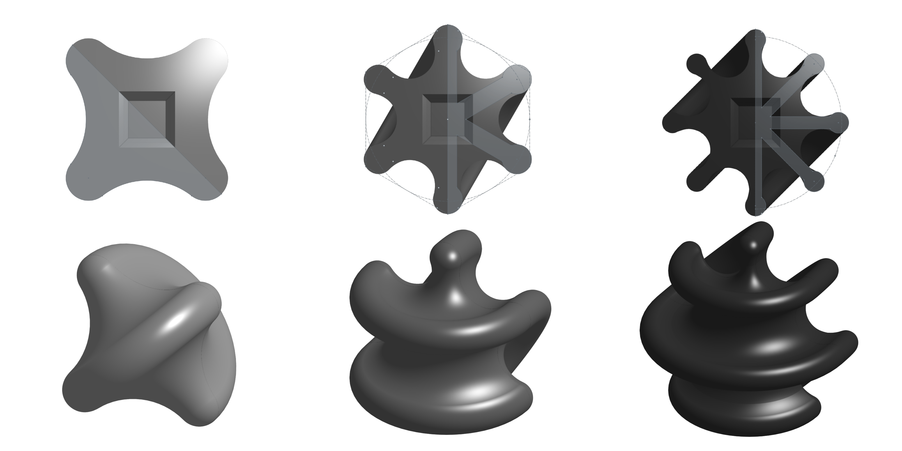

# Dylan Hensley's Engineering Portfolio
#### Welcome to My Engineering Portfolio! Here are some of the cool stuff that I've been working on.💡

<details><summary> ⬅ Click Me</summary>


## 3D Designs via Onshape 


<details><summary>Doctor Who Sonic Screwsdrivers </summary>


### Description
Based on the iconic science-fiction show "[Doctor Who](https://www.doctorwho.tv)," I created these 3D models of my favorite Sonic Screwdrivers and the "T.A.R.D.I.S." as depicted. These were the outcomes of my transition from using [Solidworks](https://www.solidworks.com) to [Onshape](https://www.onshape.com/en/). I utilized this project to teach myself how to use a brand new C.A.D. Software, and to design things that I love.
 
### Links
- [TARDIS](https://cvilleschools.onshape.com/documents/2ab7a38df7d5208ccd618aef/w/beba64fce6e7ec1388fe2998/e/bdeb1cd44200468047b4a1dc)
- [2nd Doctor's](https://cvilleschools.onshape.com/documents/b54558251b5b275bce93d561/w/e507a7c13202b057af485c86/e/eac1212738f6a088ae0ca751)
- [3rd Doctor's](https://cvilleschools.onshape.com/documents/779596b1d1d432dcc2af3a03/w/d04b260e992902aff898d69d/e/ab70ad52fa4adb6e194f76f8)
- [4th Doctor's](https://cvilleschools.onshape.com/documents/7ae925663ff74dfcfd4ea70a/w/1c32fa0b28d977891a92af9e/e/ca9b98336a741ddd30133bd4)
- [4th & 5th Doctor's](https://cvilleschools.onshape.com/documents/d71b76a3197eee60caa26bba/w/abe896f621747cce543a7122/e/12e39ea9432635e24f6e526a)
- [6th Doctor's](https://cvilleschools.onshape.com/documents/c6dee59c58b626428b77af93/w/67e2ea6620e4de4f2673361e/e/36cb70f89907529fc094bd91)
- [7th Doctor's](https://cvilleschools.onshape.com/documents/683ea5705be75d48dad65609/w/e4a09c21b4ca96f5aa27e857/e/09fdd7e5ef3741c1f31a9d5c)
- [8th Doctor's](https://cvilleschools.onshape.com/documents/faf47ef8cb47bf44ec8b4902/w/1d2710b6f6ca84e628ac5a50/e/11f29268d497e47a429aebc9)
- [War Doctor's](https://cvilleschools.onshape.com/documents/e04d0278c5011dba23353c5b/w/1ebd32476fca5e6e3e5f45b0/e/364111da166f697d70c81f34)
- [9th Doctor's](https://cvilleschools.onshape.com/documents/29e6a0cb262464120fcfd941/w/1cceba70197076f9be485bcb/e/d4c90abe3bb668475efd92c5)
- [10th Doctor's](https://cvilleschools.onshape.com/documents/c8dcb1949227e1f387f9d663/w/2be866e5b85906407fb35b3f/e/d631d37ad02433839faaedd2)
- [11th Doctor's](https://cvilleschools.onshape.com/documents/1c710018c89fcb716df0b286/w/f38f1ada1442de1311e976ff/e/f6944ab9ccfd1551354115d2)
- [12th Doctor's](https://cvilleschools.onshape.com/documents/a2151fb2690551bc6227931d/w/57b1698d8b48f226fb82d689/e/c68c5703a13fd22a9cdc44fe)

________________________________________________________________________________________________________________________________________

</details>
<details><summary>Sphericons </summary>

 
 ### Description
A [Sphericon](https://www.instructables.com/3D-Printed-Sphereicon) is a three-dimensional object with a continuous surface, two congruent semicircular edges, and four vertices defining a square. You may, however, experiment with the shape of a Sphericon and modify the number of vertices. This allows you to create a variety of fun and wacky variants.
 
 ### Links
- [Modified Sphericon](https://cvilleschools.onshape.com/documents/25778600526ac8ae216fc98f/w/326e3f9e4728bfccb47eff6d/e/4421681a61ca46ae50616060)
- [Modified HexaSphericon](https://cvilleschools.onshape.com/documents/dada66407e33fac9508f6749/w/0351b0b5ada052fcd20dc655/e/04a22147fec5fc0aa76e0ee5)
- [Modified OctaSphericon](https://cvilleschools.onshape.com/documents/2e12f09ad737dab65cc6e293/w/ca87571d705be95fb0c99152/e/780259fe2d76189f51255d31)
- [Alt. Sphericon Design Concept](https://cvilleschools.onshape.com/documents/729cfb01d2fb0e97ebe00371/w/fbf67e1b6065f9c11801c24d/e/0d94ec79963bb53e99299732)
 
 ________________________________________________________________________________________________________________________________________
 
</details>
<details><summary>Snare Drum Trophy & System Blue Replica 🥁</summary>
 

 
 ### Description
This design is inspired by Blue Devils' "[System Blue](https://www.bluedevils.org/products/system-blue/)" snare drum. The aim was to create a to-scale replica of the drum as well as a trophy design. This project allowed me to use my test CAD ability (at the time) and ignited my interest in designing percussion instruments & tools.

### Links
- [System Blue Snare Trophy](https://cvilleschools.onshape.com/documents/221b04262ae5d6cda3d83769/w/423a948d07c3116b4d8de6de/e/f6de8c8385a0bb81215d60f1)
- [Reference for Design]( https://systemblue.org/percussion/professional/)

________________________________________________________________________________________________________________________________________
 
</details>

## Most Recent Projects 
<details><summary>Snare Drum Phone & Camera Attachment V1 📱🥁</summary>

 
### Description
Many drummers across the world use Go Pro cameras to document their performances. Because I know many individuals who cannot afford to purchase a costly video recording gear, I created a Drum attachment that allows anyone to record a performance on their phone. The phone holder is angled similarly to a GoPro, allowing anyone to film a POV view of oneself performing without spending a fortune. V1 (the version displayed) is already being improved, with the camera being moved closer to the center and angle lower to show off more of the drum & hands of the player.

### Links
- [Phone Mount](https://cvilleschools.onshape.com/documents/a13c4770759a07f50d643601/w/ba4fcc164aff0949461ae9df/e/2820d4fc6e2450f7e846baa4)
- [Snare Playing Test Video](https://youtu.be/9EmNJnOfamQ)
 
 ________________________________________________________________________________________________________________________________________
 
</details>
<details><summary>Robotic Arm w/ Flex Sencors 🦾</summary>

<details><summary>Robotic Arm Code & C.A.D.</summary>

[Robotic Arm Design](https://cvilleschools.onshape.com/documents/e2edc0296736b251a4e3fe74/w/817a81a4a4728dc8bb2cad43/e/76581a513e1b4ba1cefbcda2)

``` arduino
#include <Servo.h> // HEY!!!... here's a servo

Servo servo1; // Labeling Micro Servo #1
Servo servo2; // Labeling Micro Servo #2
Servo servo3; // Labeling Micro Servo #3
Servo servo4; // Labeling Micro Servo #4
Servo servo5; // Labeling Micro Servo #5

int flex1 = A0; // Pin set up for Flex Sensor #1
int flex2 = A1; // Pin set up for Flex Sensor #2
int flex3 = A2; // Pin set up for Flex Sensor #3
int flex4 = A3; // Pin set up for Flex Sensor #4
int flex5 = A4; // Pin set up for Flex Sensor #5

void setup()
{
  Serial.begin(9600);
  
  servo1.attach(8); // Pin set up for Micro Servo #1
  servo2.attach(9); // Pin set up for Micro Servo #2
  servo3.attach(10); // Pin set up for Micro Servo #3
  servo4.attach(11); // Pin set up for Micro Servo #4
  servo5.attach(12); // Pin set up for Micro Servo #5
}

void loop()
{
  int flexValue1; // For calibrating Flex Sensor #1
  int flexValue2; // For calibrating Flex Sensor #2
  int flexValue3; // For calibrating Flex Sensor #3
  int flexValue4; // For calibrating Flex Sensor #4
  int flexValue5; // For calibrating Flex Sensor #5
  int servoPosition1; // For Synchronizing the angles of the Flex Sencor #1 to Micro Servo #1
  int servoPosition2; // For Synchronizing the angles of the Flex Sencor #2 to Micro Servo #2
  int servoPosition3; // For Synchronizing the angles of the Flex Sencor #3 to Micro Servo #3
  int servoPosition4; // For Synchronizing the angles of the Flex Sencor #4 to Micro Servo #4
  int servoPosition5; // For Synchronizing the angles of the Flex Sencor #5 to Micro Servo #5

  flexValue1 = analogRead(flex1); // Renaming analogRead for #1
  flexValue2 = analogRead(flex2); // Renaming analogRead for #2
  flexValue3 = analogRead(flex3); // Renaming analogRead for #3
  flexValue4 = analogRead(flex4); // Renaming analogRead for #4
  flexValue5 = analogRead(flex5); // Renaming analogRead for #5

  servoPosition1 = map(flexValue1, 600, 800, 0, 180); // when flex sensor #1 is bend, micro servo #1 will make the angle...
  servoPosition1 = constrain(servoPosition1, 0, 180); // .. but will not go passed 0 or 180
  servoPosition2 = map(flexValue2, 600, 800, 0, 180); // when flex sensor #2 is bend, micro servo #2 will make the angle...
  servoPosition2 = constrain(servoPosition2, 0, 180); // .. but will not go passed 0 or 180
  servoPosition3 = map(flexValue3, 600, 800, 0, 180); // when flex sensor #3 is bend, micro servo #3 will make the angle...
  servoPosition3 = constrain(servoPosition3, 0, 180); // .. but will not go passed 0 or 180
  servoPosition4 = map(flexValue4, 600, 800, 0, 180); // when flex sensor #4 is bend, micro servo #4 will make the angle...
  servoPosition4 = constrain(servoPosition4, 0, 180); // .. but will not go passed 0 or 180
  servoPosition5 = map(flexValue5, 600, 800, 0, 180); // when flex sensor #5 is bend, micro servo #5 will make the angle...
  servoPosition5 = constrain(servoPosition5, 0, 180); // .. but will not go passed 0 or 180

  servo1.write(servoPosition1);
  servo2.write(servoPosition2);
  servo3.write(servoPosition3);
  servo4.write(servoPosition4);
  servo5.write(servoPosition5);

  delay(100); // reaction time for Micro Servo
  }
```
</details>

### Description
The purpose of this project was to construct a flex sensor operated Robotic Arm that could replicate an individual's hand motion. The user could wear a glove with the flex sensors connected, and the robotic arm would perform the same functions as the user. The concept was that when fully developed, it could be utilized for a variety of jobs like prosthetic use, long-distance surgery, handling dangerous chemicals, and so on.

### Links
- [Original Github Link](https://github.com/DylnH/Robotic-Hand)
- [Robotic Hand Test Video]( https://youtu.be/bA-HL_byXRw)
 ________________________________________________________________________________________________________________________________________
 
</details>
<details><summary>Laser Cutting, Etching & Lichtenberg burning ⚡</summary>

 
 ### Description
These are some of the latest laser cutting and engraving experiments I've done. These projects have pushed me to use my artistic side and to prioritize aesthetics above utility. By doing these, I was able to explore with different spray painting methods, Lichtenberg burning, and more sophisticated laser cutting techniques, which was a lot of fun. All of the pieces shown, were either gifted to someone else or purchased.

### Links
- [Lichtenberg Ying & Yang](https://cvilleschools.onshape.com/documents/2ab7a38df7d5208ccd618aef/w/beba64fce6e7ec1388fe2998/e/bdeb1cd44200468047b4a1dc)
- [志安](https://cvilleschools.onshape.com/documents/27b4753e7467629397baaf20/w/e345d744fa2b0125c1c10a95/e/bd2b7cdfb00b7aeabba79946)
- [Constellation](https://cvilleschools.onshape.com/documents/27b4753e7467629397baaf20/w/e345d744fa2b0125c1c10a95/e/bd2b7cdfb00b7aeabba79946)
 
 ________________________________________________________________________________________________________________________________________
 
</details>
 
## Concepts I'd Like to Experiment With in the Future ⏰

- Designing Drum Technology & Equipment
- Utilitarian Art
- Prop & Replica Making
- Soft Robotics
- Cost Effective Prosthetics & Mobility Aids


## Contact Info
 
###### - dhnlyoiy@gmail.com
###### - dhensle63@charlottesvilleschools.org
###### - (510)387-1662
 

 

